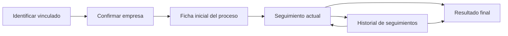

# Flujo operativo de Seguimientos IL

Esta guia resume el flujo grafico y operativo de `Seguimientos IL` sin cambiar la fuente de verdad del caso.

- Se conserva el mismo Google Sheet / Excel.
- Se conservan las mismas hojas, celdas, payloads y criterio de avance por `90%`.
- Cambia la experiencia de uso: ahora el profesional trabaja por etapas visibles y no por nombres tecnicos de hojas.

## Ruta rapida

1. `Identificar vinculado`: buscar la cedula y cargar el caso.
2. `Confirmar empresa`: validar empresa, profesional asignado y si es Compensar o no.
3. `Ficha inicial del proceso`: diligenciar visita, contexto del caso, datos del vinculado y apoyos.
4. `Seguimiento actual`: continuar solo en la etapa sugerida.
5. `Historial de seguimientos`: entrar solo si se necesita corregir un seguimiento anterior.
6. `Resultado final`: revisar el consolidado automatico del caso.

## Mapa del proceso

## Estados visibles en la app

| Estado | Significado operativo |
| --- | --- |
| `Pendiente` | La etapa aun no se ha empezado. |
| `En curso` | Ya hay datos diligenciados, pero aun no llega al `90%`. |
| `Completa` | La etapa ya alcanzo el umbral operativo. |
| `Solo lectura` | La etapa se consulta, pero no se diligencia manualmente. |

## Etapas del flujo

| Etapa visible | Que diligencia el profesional | Que hereda automatico | Cuando pasar a la siguiente |
| --- | --- | --- | --- |
| `Identificar vinculado` | Cedula y seleccion del caso. | Datos base del vinculado si ya existen en el sistema. | Cuando la persona y el caso ya estan cargados. |
| `Confirmar empresa` | Empresa, tipo de empresa y contexto del caso. | Datos empresariales existentes y profesional asignado. | Cuando la empresa queda confirmada. |
| `Ficha inicial del proceso` | `Datos de visita`, `Empresa`, `Datos del vinculado`, `Funciones y apoyos`. | Fechas visibles del timeline y datos precargados del caso. | Cuando la ficha inicial llega al `90%`. |
| `Seguimiento actual` | `Datos del seguimiento`, `Desempeno del vinculado`, `Evaluacion de la empresa`, `Situacion y estrategias`, `Asistentes`. | Fecha del seguimiento activo y opcion de copiar el seguimiento anterior. | Cuando el seguimiento actual llega al `90%`. |
| `Historial de seguimientos` | Correcciones puntuales sobre seguimientos previos. | Estado historico de cada seguimiento. | Solo cuando haya que corregir. Si no, continuar desde la etapa sugerida. |
| `Resultado final` | Revision del consolidado. | Ponderado final y consolidado automatico. | No se diligencia manualmente. |

## Regla visual principal

- La accion persistente de la pantalla es `Continuar donde voy`.
- La app siempre resalta una sola `etapa sugerida`.
- Las etapas anteriores quedan visibles para contexto o correccion, pero no desplazan la etapa sugerida.

## Lo que ahora ahorra tiempo

- `Continuar donde voy`: evita pensar en que hoja abrir.
- `Copiar seguimiento anterior`: reutiliza informacion del seguimiento previo.
- `Acciones rapidas de diligenciamiento`: aplica evaluaciones en bloque.
- `Borrador local automatico`: protege lo diligenciado aunque todavia no se haga guardado remoto.
- `Linea de tiempo de seguimientos`: muestra fechas historicas en la ficha inicial sin obligar a navegar entre hojas.

## Cuando corregir un caso ya iniciado

- Abrir el caso y revisar la `etapa sugerida`.
- Si el ajuste pertenece al seguimiento actual, trabajar ahi.
- Si el ajuste pertenece a un seguimiento previo, entrar desde `Historial de seguimientos`, corregir y volver a `Continuar donde voy`.
- `Resultado final` se usa solo para lectura.

## Lenguaje operativo que reemplaza nombres tecnicos

| Nombre tecnico anterior | Nombre visible en la app |
| --- | --- |
| `Hoja 9` | `Ficha inicial del proceso` |
| `SEGUIMIENTO PROCESO IL X` | `Seguimiento X` |
| `PONDERADO FINAL` | `Resultado final` |

